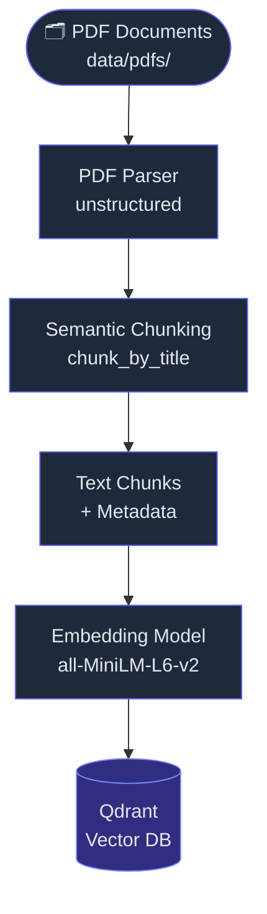
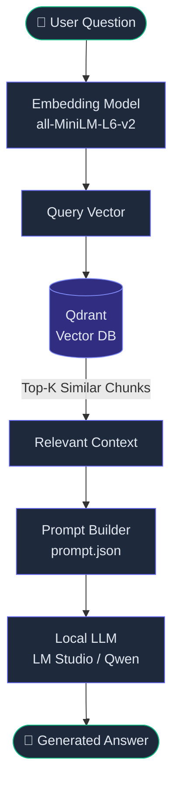

# Local RAG Fitness Knowledge Base

A complete local Retrieval-Augmented Generation (RAG) system for answering fitness-related questions based on PDF journals and literature. It now includes a sleek glassmorphic Web Chat UI.

## Architecture

This project is built using an entirely local, production-ready stack:
- **PDF Parsing & Semantic Chunking**: [Unstructured](https://unstructured.io/)
- **Embeddings Model**: `sentence-transformers` (`all-MiniLM-L6-v2`)
- **Vector Database**: [Qdrant](https://qdrant.tech/) (running locally in Docker at `localhost:6333`)
- **Local LLM Integration**: [LM Studio](https://lmstudio.ai/) served via an OpenAI-compatible REST API.
- **Web UI**: Flask with vanilla HTML/CSS for an ultra-premium glassmorphic aesthetic.

## High-Level Process Flow

### 📥 Ingestion Pipeline


### 🔍 Query Pipeline


## Repository Structure

```
rag-fitness-knowledge-base/
├── data/
│   └── pdfs/              # Place your PDF documents (fitness journals/papers) here
├── templates/
│   └── index.html         # The frontend web chat interface
├── webui.py               # Flask server to launch the Web UI
├── ingestion.py           # Loads PDFs, performs semantic chunking, and stores them via QdrantStore
├── qdrant_store.py        # Connects to Qdrant, manages collections, and computes embeddings
├── retriever.py           # Exposes an API for executing similarity searches against Qdrant
├── llm.py                 # Connects to the local LM Studio instance to generate responses
├── app.py                 # The CLI entry point for asking questions (alternative to Web UI)
└── README.md              # Project documentation
```

## Prerequisites

1. **Python 3.8+**
2. **Docker** (Required to run Qdrant)
3. **LM Studio** (Required to run the local LLM constraint-free)

## Setup & Installation

### 1. Install System Dependencies (Linux)
You will need Poppler and Tesseract for the `unstructured` library to OCR your PDFs.
```bash
sudo apt-get install poppler-utils tesseract-ocr
```

### 2. Install Python Dependencies
Install the required python packages using `pip`:
```bash
pip install unstructured[pdf,html] sentence-transformers qdrant-client openai flask
```

Download the strictly necessary NLTK language components for semantic chunking:
```bash
python -c "import nltk; nltk.download('punkt'); nltk.download('punkt_tab'); nltk.download('averaged_perceptron_tagger'); nltk.download('averaged_perceptron_tagger_eng')"
```

### 3. Start Qdrant Vector DB
Run a local Qdrant instance using Docker:
```bash
docker run -p 6333:6333 -p 6334:6334 \
    -v $(pwd)/qdrant_storage:/qdrant/storage:z \
    qdrant/qdrant
```

### 4. Setup the Local LLM in LM Studio
1. Open **LM Studio**.
2. Download a model like **Qwen 3.5**.
3. Navigate to the **Local Server** (`<->`) tab.
4. **CRITICAL STEP FOR WSL USERS**:
   - Change the Network binding from `localhost` to **`Any IP (0.0.0.0)`** OR **`All networks`**.
   - Make sure **CORS** is checked ON.
5. Click **Start Server**.
6. *(Optional)* Update `llm.py`'s `base_url` to match the exact Windows IP address visible in WSL (e.g. `http://10.255.255.254:1234/v1`).

---

## Usage

### Step 1: Data Ingestion

Place your fitness-related PDF files into the `data/pdfs/` directory. Run the ingestion script to parse, extract text via OCR, segment context logically via NLTK, and store the embeddings in Qdrant:

```bash
python ingestion.py
```

### Step 2: Query via the Web UI (Recommended)

Start the interactive chat environment:
```bash
python webui.py
```
Open a browser and navigate to: `http://127.0.0.1:5000`

### Step 3: Query via CLI (Alternative)

If you prefer terminal output:
```bash
python app.py "What is the optimal training volume per week for muscle hypertrophy?"
```